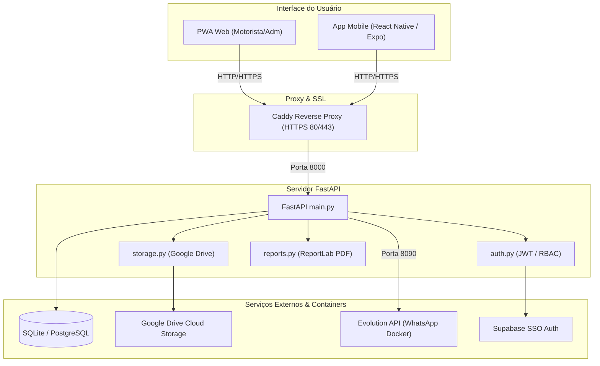
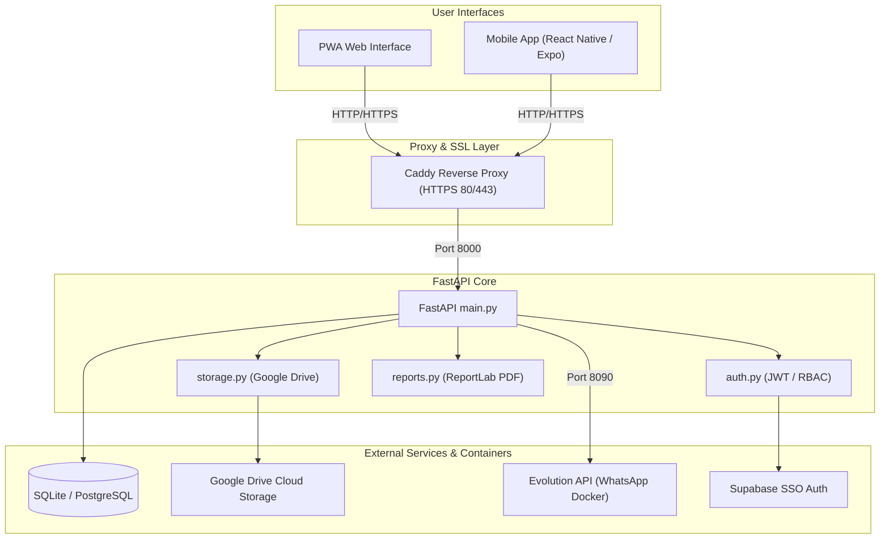

# SS Gas Control


[Português](#português) | [English](#english)

---

## Português

### 📌 Visão Geral

O **SS Gas Control** é um sistema corporativo completo para gestão, controle e logística de entrega de cilindros de gás da **Servweld**. Desenvolvido com foco em mobilidade, rastreabilidade e integração total em nuvem, o sistema permite que motoristas registrem entregas em tempo real direto do campo, enquanto a equipe administrativa monitora o histórico, fotos, localizações no mapa e envia notificações automáticas via WhatsApp.

---

### 🚀 Funcionalidades Desenvolvidas

- **📝 Registro de Entregas em Tempo Real:**
  - Lançamento de entregas com número de documento/nota fiscal, dados do cliente e tipo de operação (*Entrega, Recolha, Troca*).
  - Detalhamento individual por cilindro: tipo de gás (*Argônio, CO2, Mistura, Oxigênio, Acetileno, etc.*), capacidade/tamanho, quantidade, marca do cilindro, observações e foto individual.
  - Cálculo automático da data de validade com base no tipo de gás selecionado.

- **☁️ Armazenamento em Nuvem no Google Drive:**
  - Envio automático em tempo real das fotos de comprovantes e cilindros para o Google Drive via **Google Drive API (Conta de Serviço / OAuth2)**.
  - Organizador hierárquico automatizado de pastas:  
    `Pasta Raiz > [Nome do Cliente] > [Ano] > [Mês] > Nota_[Número]`
  - Aplicação de permissões públicas automáticas nos arquivos para visualização instantânea no painel sem telas de bloqueio de permissão.

- **📱 Notificações Automáticas via WhatsApp (Evolution API):**
  - Envio automático de comprovantes e resumos detalhados das entregas diretamente para os clientes ou motoristas pelo WhatsApp através da **Evolution API (v1.8.7)**.
  - Funcionalidade de reenvio de notificação com um único clique no painel administrativo.
  - Painel de controle do WhatsApp integrado para exibição de status, geração de QR Code para pareamento e desconexão de instâncias.

- **📍 Geolocalização GPS & Roteamento Inteligente:**
  - Captura automática das coordenadas GPS (latitude e longitude) no instante em que o motorista registra a entrega.
  - Atualização do cadastro de localização do cliente com base no GPS do dispositivo.
  - Atalho de navegação em 1 clique para abrir a rota até o cliente no **Google Maps** ou **Waze**.

- **📄 Geração Automatizada de Relatórios PDF (ReportLab):**
  - Geração dinâmica de comprovantes de entrega padronizados em formato PDF contendo a logomarca da empresa (**Servweld**), informações completas do cliente, data da aplicação e tabela detalhada dos cilindros movimentados.

- **🔍 Consulta Automática de CNPJ:**
  - Integração com API de consulta de CNPJ para autopreenchimento de Razão Social e dados cadastrais ao digitar o documento do cliente.

- **🗺️ Mapa Interativo & Filtros de Histórico (Leaflet.js):**
  - Exibição de mapa interativo via **Leaflet.js** para visualização espacial dos clientes e entregas.
  - Filtro avançado de entregas por cliente, período e número da nota fiscal com carregamento dinâmico de imagens e histórico de movimentações.

- **🖼️ Proxy de Imagens Seguro & Painel Administrativo:**
  - Endpoint dedicado (`/api/proxy-image/{file_id}`) que serve como proxy para as imagens do Google Drive, contornando bloqueios de CORS e autenticação nos navegadores e aplicativo móvel.
  - Painel administrativo para gestão de usuários, cadastro de gases e validades, gerenciamento de marcas, configuração e testes da integração com o Google Drive.

- **🔐 Controle de Acesso (RBAC) & Autenticação Supabase:**
  - Sistema de permissões com papéis definidos: `adm` (Administrador) e `usuario` (Motorista/Operador).
  - Suporte a autenticação Supabase SSO (JWT decoding) com sincronização e fallback de auto-recuperação no banco local SQLite/PostgreSQL.

- **📲 Progressive Web App (PWA) & App Mobile:**
  - Interface Web PWA instalável com suporte offline inicial via Service Workers (`sw.js`) e manifesto Web (`manifest.json`).
  - Projeto foundation mobile desenvolvido em **React Native / Expo** para futura expansão nativa iOS/Android.

---

### 🛠️ Stack de Tecnologias

| Camada | Tecnologia / Lib | Descrição |
| :--- | :--- | :--- |
| **Backend** | Python 3.8+ / FastAPI | API RESTful assíncrona de alta performance |
| **ORM / Banco** | SQLAlchemy / SQLite (Dev) / PostgreSQL (Prod) | Modelagem relacional (`Usuario`, `Cliente`, `Entrega`, `CilindroAplicado`, `Gas`) |
| **PDF Engine** | ReportLab | Geração dinâmica de relatórios em PDF |
| **Imagem** | Pillow (PIL) | Processamento e validação de imagens |
| **Frontend Web** | HTML5, CSS3, JavaScript (ES6+), Leaflet.js | Interface responsiva mobile-first com mapa interativo |
| **PWA** | Service Workers & Web Manifest | Suporte a instalação como App Web no celular |
| **App Mobile** | React Native / Expo | Base para aplicativo mobile nativo |
| **Integração Nuvem** | Google Drive API v3 | Upload e organização hierárquica de arquivos em nuvem |
| **Mensageria** | Evolution API v1.8.7 | Gateway para envio automatizado de WhatsApp |
| **Autenticação** | Supabase Auth (JWT) | Autenticação unificada com fallback local |
| **DevOps / Proxy** | Docker, Docker Compose, Caddy | Conteinerização e Proxy Reverso com SSL/TLS automático |

---

### 🏗️ Arquitetura do Sistema



---

### ⚙️ Variáveis de Ambiente (`.env`)

Exemplo de configuração para o arquivo `.env`:

```env
# Banco de Dados
DATABASE_URL=sqlite:///./test.db
DB_USER=gas_user
DB_PASSWORD=senha_segura
DB_NAME=ss_gas_control

# Google Drive Integration
DRIVE_ROOT_FOLDER_ID=seu_folder_id_do_google_drive
GOOGLE_APPLICATION_CREDENTIALS=/app/service-account.json

# Supabase Authentication
SUPABASE_URL=https://xxxxxx.supabase.co
SUPABASE_ANON_KEY=sua_anon_key_aqui

# Porta da Aplicação
PORT=8000
```

---

### 💻 Como Executar Localmente

#### 1. Instalação Tradicional (Python)
```bash
# Clone o repositório
git clone https://github.com/fernandoapaiva-dotcom/ss_gas_control.git
cd ss_gas_control

# Crie e ative um ambiente virtual
python -m venv .venv
source .venv/bin/activate  # Linux/Mac
# ou .venv\Scripts\activate # Windows

# Instale as dependências
pip install -r requirements.txt

# Adicione o arquivo service-account.json na raiz do projeto
# Crie e configure o arquivo .env (baseado no .env.example)

# Execute as migrações iniciais do banco
python migrate_marca.py

# Inicie o servidor Backend
python main.py
```
Acesse a aplicação no navegador em: `http://localhost:8000`

#### 2. Execução via Docker Compose
```bash
docker-compose up -d --build
```

---

### ☁️ Implantação em Produção (Oracle Cloud - OCI)

O projeto está pronto para implantação conteinerizada em instâncias **Oracle Cloud (OCI)** com emissão automática de certificados SSL via **Caddy**.

1. Certifique-se de ter o `docker` e `docker-compose` instalados na instância.
2. Copie os arquivos do projeto incluindo o `service-account.json` e `.env`.
3. Abra as portas `80`, `443` e `8002` na **Security List da VCN** e no firewall da máquina (`iptables`/`firewalld`).
4. Execute:
   ```bash
   docker-compose up -d --build
   ```
Para instruções detalhadas, consulte o arquivo [`OCI_DEPLOY_GUIDE.md`](file:///c:/Antigravity/ss_gas_control/OCI_DEPLOY_GUIDE.md).

---

---

## English

### 📌 Overview

**SS Gas Control** is an enterprise gas cylinder delivery, management, and logistics system built for **Servweld**. Designed with a strong focus on mobility, traceability, and cloud integration, the platform enables field drivers to register deliveries in real-time using mobile devices, while administrative staff monitor delivery histories, inspection photos, map locations, and send automated notifications via WhatsApp.

---

### 🚀 Developed Features

- **📝 Real-Time Delivery Registration:**
  - Delivery record creation capturing document/invoice numbers, customer information, and operation types (*Delivery, Collection, Exchange*).
  - Per-cylinder breakdown: gas type (*Argon, CO2, Mixture, Oxygen, Acetylene, etc.*), tank capacity/size, quantity, cylinder brand, notes, and individual photo attachments.
  - Automatic expiration date calculation based on selected gas shelf life.

- **☁️ Google Drive Cloud Storage Integration:**
  - Instant real-time upload of receipt photos and cylinder condition images directly to Google Drive using the **Google Drive API (Service Account / OAuth2)**.
  - Automated hierarchical directory structure:  
    `Root Folder > [Customer Name] > [Year] > [Month] > Invoice_[Number]`
  - Automatic public read permission assignment on uploaded media for seamless inline previewing without access request prompts.

- **📱 Automated WhatsApp Notifications (Evolution API):**
  - Automatic dispatch of delivery receipts and detailed transaction summaries to customers or drivers via WhatsApp using **Evolution API (v1.8.7)**.
  - One-click notification resend functionality inside the administrative dashboard.
  - Embedded WhatsApp manager UI for instance status tracking, pairing QR code generation, and session control.

- **📍 GPS Geolocation & Smart Navigation:**
  - Automatic GPS coordinate capture (latitude and longitude) at the exact moment delivery photos are captured.
  - Automatic updates to customer geographical records based on actual field GPS readings.
  - 1-Click route launch shortcuts directly into **Google Maps** or **Waze**.

- **📄 Automated PDF Report Generation (ReportLab):**
  - Dynamic compilation of standardized PDF delivery receipts featuring company branding (**Servweld**), customer details, timestamp, and a structured itemized cylinder table.

- **🔍 Automatic CNPJ Lookup:**
  - Integration with external CNPJ lookup APIs to automatically pre-fill company names and corporate registry data upon typing the customer document number.

- **🗺️ Interactive Map & History Filters (Leaflet.js):**
  - Interactive map integration using **Leaflet.js** for spatial visualization of client locations and delivery logs.
  - Comprehensive filtering options by customer, date range, and invoice number with dynamic image rendering.

- **🖼️ Secure Image Proxy & Admin Dashboard:**
  - Dedicated `/api/proxy-image/{file_id}` proxy endpoint to serve Google Drive media safely, bypassing CORS policies and authentication barriers on web and mobile devices.
  - Admin panel for managing users, gas definitions, cylinder brands, and Google Drive connection statuses.

- **🔐 Role-Based Access Control (RBAC) & Supabase Auth:**
  - Role-based permissions supporting `adm` (Admin) and `usuario` (Driver/Operator).
  - Supabase SSO integration (JWT decoding) paired with local self-healing synchronization for SQLite/PostgreSQL.

- **📲 Progressive Web App (PWA) & Mobile App:**
  - Installable web app interface featuring offline Service Workers (`sw.js`) and Web Manifest (`manifest.json`).
  - Mobile foundation project built with **React Native / Expo** for future native app distribution.

---

### 🛠️ Tech Stack

| Layer | Technology / Library | Description |
| :--- | :--- | :--- |
| **Backend** | Python 3.8+ / FastAPI | High-performance asynchronous REST API |
| **ORM / Database** | SQLAlchemy / SQLite (Dev) / PostgreSQL (Prod) | Relational database schema (`Usuario`, `Cliente`, `Entrega`, `CilindroAplicado`, `Gas`) |
| **PDF Engine** | ReportLab | Automated PDF document compilation |
| **Image Handling** | Pillow (PIL) | Image transformation and format processing |
| **Web Frontend** | HTML5, CSS3, JavaScript (ES6+), Leaflet.js | Mobile-first responsive UI with interactive mapping |
| **PWA** | Service Workers & Web Manifest | Native-like web installation support |
| **Mobile App** | React Native / Expo | Native mobile project codebase |
| **Cloud Services** | Google Drive API v3 | Hierarchical cloud media storage |
| **Messaging** | Evolution API v1.8.7 | WhatsApp messaging gateway container |
| **Authentication** | Supabase Auth (JWT) | Unified SSO auth with local fallback |
| **DevOps / Proxy** | Docker, Docker Compose, Caddy | Container orchestration & reverse proxy with auto SSL |

---

### 🏗️ System Architecture



---

### ⚙️ Environment Variables (`.env`)

Example `.env` configuration file:

```env
# Database Settings
DATABASE_URL=sqlite:///./test.db
DB_USER=gas_user
DB_PASSWORD=secure_password
DB_NAME=ss_gas_control

# Google Drive Integration
DRIVE_ROOT_FOLDER_ID=your_google_drive_folder_id
GOOGLE_APPLICATION_CREDENTIALS=/app/service-account.json

# Supabase Authentication
SUPABASE_URL=https://xxxxxx.supabase.co
SUPABASE_ANON_KEY=your_anon_key_here

# Application Port
PORT=8000
```

---

### 💻 How to Run Locally

#### 1. Standard Python Setup
```bash
# Clone the repository
git clone https://github.com/fernandoapaiva-dotcom/ss_gas_control.git
cd ss_gas_control

# Create and activate a virtual environment
python -m venv .venv
source .venv/bin/activate  # Linux/Mac
# or .venv\Scripts\activate # Windows

# Install requirements
pip install -r requirements.txt

# Add your service-account.json file to the root directory
# Configure your .env file (based on .env.example)

# Run initial migrations
python migrate_marca.py

# Start the Backend server
python main.py
```
Access the web app at: `http://localhost:8000`

#### 2. Docker Compose Setup
```bash
docker-compose up -d --build
```

---

### ☁️ Production Deployment (Oracle Cloud - OCI)

The platform is pre-configured for containerized deployment on **Oracle Cloud Infrastructure (OCI)** with automatic SSL certificate management via **Caddy**.

1. Ensure `docker` and `docker-compose` are installed on your server instance.
2. Transfer project files including `service-account.json` and `.env`.
3. Open ports `80`, `443`, and `8002` in your **VCN Security List** and server firewall.
4. Launch the stack:
   ```bash
   docker-compose up -d --build
   ```
For complete step-by-step instructions, see [`OCI_DEPLOY_GUIDE.md`](file:///c:/Antigravity/ss_gas_control/OCI_DEPLOY_GUIDE.md).
